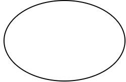
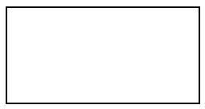
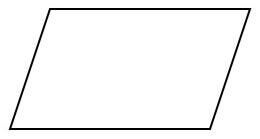
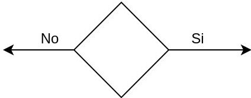
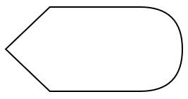
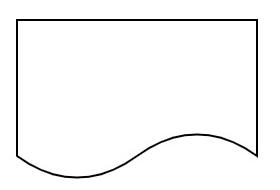
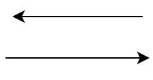
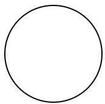
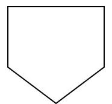
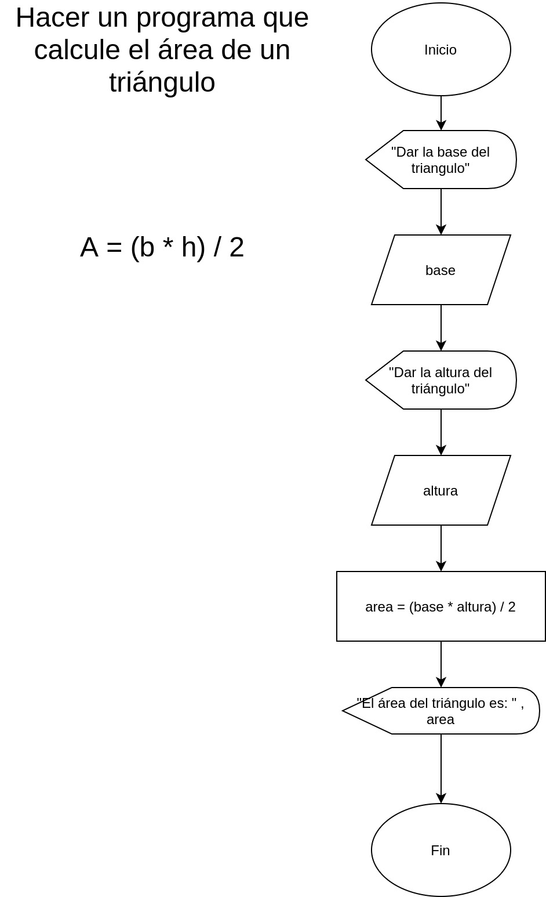

# Simbología de Digrama de flujos

Dentro de los diagramas de flujo existe una varidad de simbologia, sin embargo, aqui solo estatemos viendo la simbologiaa basica.

Nombre|Símbolo
:-:|:-:
Inicio/Fin| 
Proceso u Operación| 
Entrada/Salida de datos| 
Decisión| 
Display| 
Documento| 
Líneas de flujo| 
Conector en misma página| 
Conector a otro página| 

# Ejemplo de Diagrama de flujo

Aquí se muestra un diagrama de flujo que realiza el cálculo del area de un triángulo.

<figcaption>Ejemplo de un diagrama de flujo que calcula eel area de un triangulo</figcaption>
