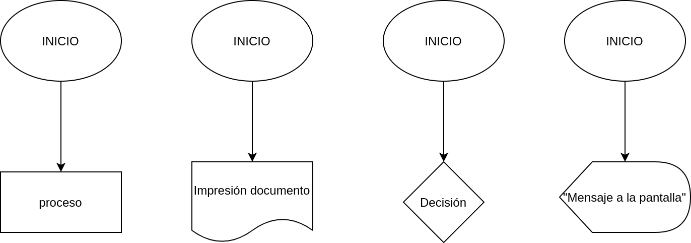
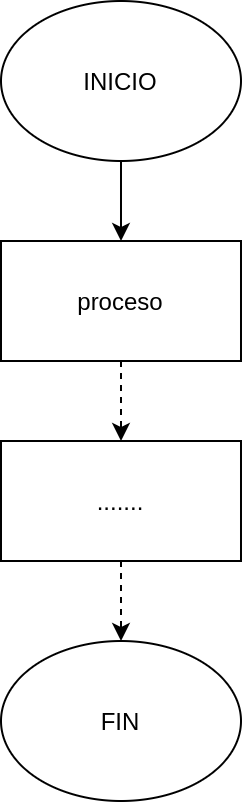

# Estructura de un diagrama de flujo

Se describe a continuación el proceso de la creación de un diagrama de flujo

Posteriormente se coloca el símbolo que necesites, dependiendo de lo que que deba realizar el algoritmo, normalmente se coloca un proceso, una impresión, adquisición de datos o rara vez una decision.

Después de haber realizado y resolver el problema solicitado, se debe colocar el símbolo de "FIN", con ello indicamos que el algoritmo termina, *si lo que debe resolver es infinito; es decir, nunca termina no llevara este símbolo*

## Resumen

- Todo diagrama de flujo comienza con su símbolo de **INICIO**
- Después se realizan todas las operaciones necesarias
- Al final de todo diagrama lleva su **FIN**, *excepto cuando el algoritmo queda en un ciclo infinito*

<!-- text autogenerated footer -->
<blockquote>Facebook <a href="https://www.facebook.com/mecatronica85/" target="_blank">Mecatrónica 85</a></blockquote><blockquote>Realizado por <a href="https://www.alejandro-leyva.com" target="_blank">Alejandro Leyva</a></blockquote>