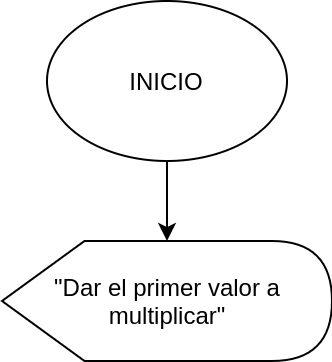
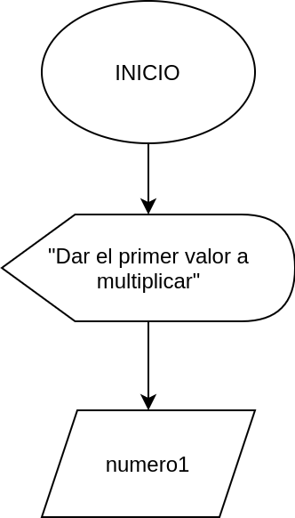
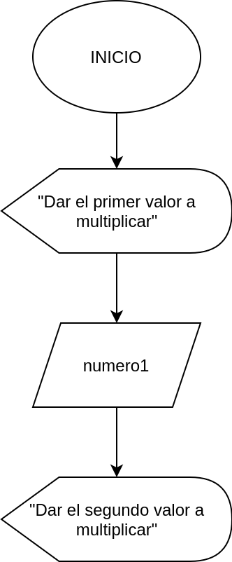
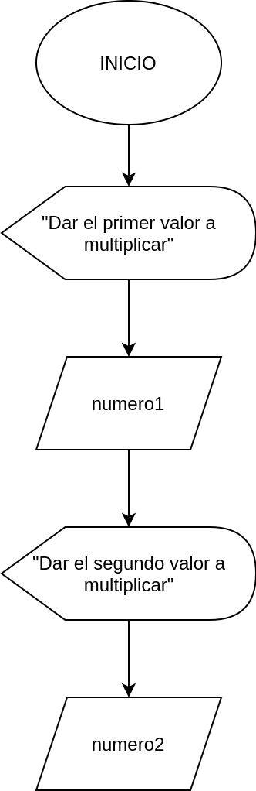
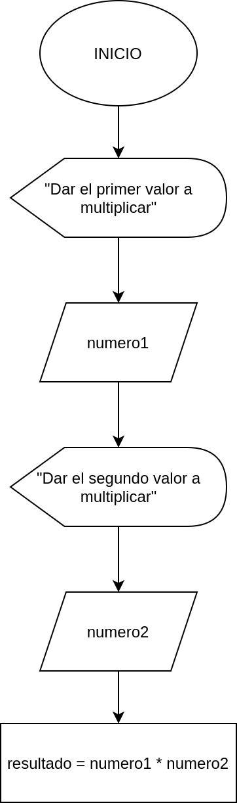
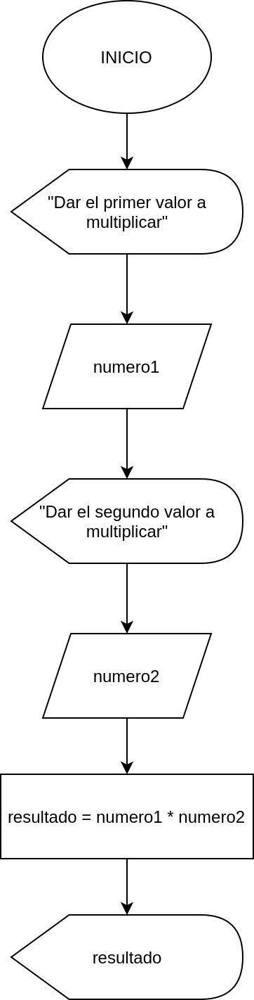
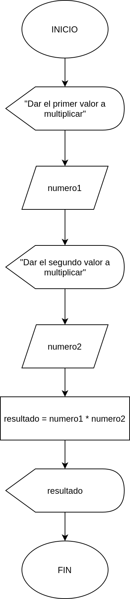

# Operadores aritméticos

En esta sección veremos los operadores aritméticos básicos que podemos encontrar en la mayoría de lenguajes.

Nombre | Símbolo | Descripción
:-|:-:|:-
Suma| + | Realiza la operación de suma aritmética
Resta| - | Realiza la operación de resta aritmética
Multiplicación| * | Realiza la operación de multiplicación aritmética
División| / | Realiza la operación de razón aritmética
Residuo o Módulo| % | Realiza la operación de división aritmética y devuelve el residuo de ésta división

*Cuando somos nuevos en el mundo de la programación queremos aplicar conocimiento que tenemos con relación a matemáticas, aquí existen algunas cuestiones que no se aplican de la misma manera o solo se puede aplicar de cierta forma.*

*Precauciones que debemos tener en cuenta son:*

- El único símbolo que podemos ocupar para la **división** es la diagonal o slash (/), no existe otro símbolo ni tampoco se puede ocupar los tradicionales que conocemos.
- El único símbolo para **multiplicación** es el asterisco (\*), no existe algun otro ni ninguno más sirve para multiplicar.
- **Los paréntesis** "( )" solo agrupan y nada mas. **No sirven para multiplicar**. 

## Ejemplos

**1. Realizar la multiplicación de dos numeros que ingrese el usuario e imprimir el resultado por pantalla**

Como ya sabemos debemos comenzar con nuestro símbolo de *INICIO*, posteriormente debemos mandar un mensaje a la pantalla indicandole al usuario lo que debe realizar. El mensaje será `"Dar el primer valor a multiplicar"`

Después de mandar el mensaje, debemos recibir y almacenar ese valor. Por lo tanto, usamos el símbolo de ingreso de datos y lo tenemos que almacenar en una variable. Esta variable la llamaremos `numero1`.

Una vez que ya tenemos el primer valor almacenado en memoria, vamos a mandar otro mensaje indicándole al usuario qué debe realizar. El mensaje será `"Dar el segundo valor a multiplciar"`

Siguiente paso es almacenar el dato que el usuario ingresará; lo guardaremos en una variable llamada `numero2`.

Ahora que ya tenemos los valores que ingreso el usuario en las variables `numero1` y `numero2`, debemos realizar la operación matemáticas, en el *símbolo de proceso u operación*, este resultado guardarlo en la variable `resultado`.

Una vez ya tenemos el resultado de la operación dentro de la variable `resultado`, solo nos quedo enviarlo a la pantalla y que el usuario conozco el resultado.

Hemos terminado todas las acciones que ibas a realizar, solo nos queda terminar con el símbolo de *FIN*, con esto indicamos que el diagrama de flujo ha terminado su tarea.

## Precedencia de operadores

*La precedencia de operadores funciona prácticamente igual que en matemáticas.* Recordemos que solo existen 5 operaciones aritméticas básicas en la programación (*Nota: En concreto por lenguaje puede variar*). 

|Orden|Operación| Símbolo| Descripción
|:-:|:-|:-:|:-
|1|Agrupación| ( ) | Los paréntesis solo realizan la operación de agrupar (no operación aritmética), la operación que esta en los paréntesis mas profundos son las primeras que se realizan
|2|Residuo|%| Obtiene el residuo de una división
|3|División|/| Realiza una división aritmética
|4|Multiplicación|\*| Realiza una multiplicación aritmética
|5|Suma|+| Realiza una suma aritmética
|6|Resta|-| Realiza una resta aritmética

Vamos a hacer una comparativa en la forma matemáticas convencional y como se realiza en diagramas de flujo o programación (esto aplica prácticamente a cualquier lenguaje)

## Ejemplos

|matemáticas | Programación|
|:-:|:-:|
|$4+3$|**4 + 3**|
|$10-3$|**10 - 3**|
|$5\times 5$| **5 \* 5**|
|$\frac{3}{2}$| **2 / 3**|
|$\frac{2 + 4}{6}$| **( 2 + 4 ) / 6**|
|$2 +  \frac{4}{3}$| **2 + ( 4 / 3 )**|
|$\frac{x+y+z}{w}$| **( x  + y + z ) / w**|
|$x ^2$| **x \* x**|

## Ejercicios 

Transformar las siguientes expresiones matemáticas a una representación de diagrama de flujo.

|matemáticas | Programación|
|:-:|-|
|$x + y$| 
|$\frac{4 - 2}{5}$| 
|$3 + \frac{4}{8}$| 
|$6 + 4 \times \frac{3}{9}$| 
|$\frac{3}{7} + \frac{8}{3}$| 

<!-- text autogenerated footer -->
<blockquote>Facebook <a href="https://www.facebook.com/mecatronica85/" target="_blank">Mecatrónica 85</a></blockquote><blockquote>Realizado por <a href="https://www.alejandro-leyva.com" target="_blank">Alejandro Leyva</a></blockquote>