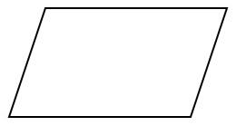

# Entradas y salidas

Dentro de todo algoritmo tendremos salidas y entrada de datos, en este caso el ingresar información es correspondiente a un numero, letra o conjunto de caracteres (String). Para mandar el resultado de lo que estemos realizando tendremos que usar una salida.

## Entrada (Input)

La entrada de datos o de información lo haremos con los símbolos siguiente:

Símbolo |Nombre
-|-
 | Entrada/Salida (Tiene 2 funciones)

## Salida (Output)

La salida de información es muy variada, dado que el contexto de la aplicación o el algoritmo puede tomar una u otro. Lo que nos atañe es que al final sigue siendo una salida de información por algún medio ya sea físico o digital.

Símbolo |Nombre
-|:-:
 | Salida a pantalla (Display)
 | Entrada/Salida (Tiene 2 funciones)
| Salida a documento (impresión en hoja)

<!-- text autogenerated footer -->
<blockquote>Facebook <a href="https://www.facebook.com/mecatronica85/" target="_blank">Mecatrónica 85</a></blockquote><blockquote>Realizado por <a href="https://www.alejandro-leyva.com" target="_blank">Alejandro Leyva</a></blockquote>