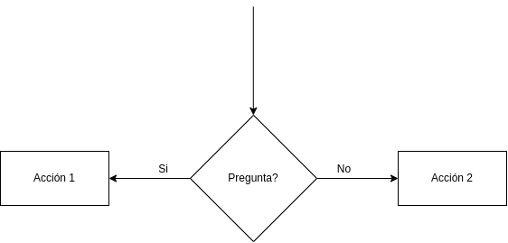
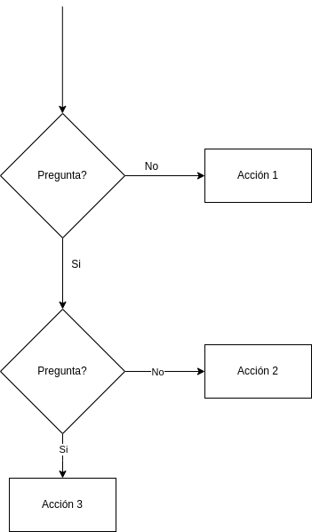

# Comparaciones o Decisiones (if) 

Una comparación me ayuda a poder cambiar una ruta o indicar hacer otra tarea con base a una comparación, con ello podemos hacer mas diverso y variante nuestro algoritmo, puesto no todo es estático y podemos hacer nuestro programa dinámico.

Dentro de una comparación se realiza una pregunta, la cual las únicas respuestas puede ser `si` o `no`, *no existe otra respuesta*; por lo tanto, debemos pensar como sera la pregunta para obtener la respuesta que necesitamos y con ello moderar el flujo o el avance del algoritmo.

<figcaption>Decision básica</figcaption>

Las preguntas pueden estar anidadas, es decir, pueden ser consecutivas hasta que alguna coincida, no es necesario que coincida con alguna.

<figcaption>Decisiones anidadas</figcaption>

<!-- text autogenerated footer -->
<blockquote>Facebook <a href="https://www.facebook.com/mecatronica85/" target="_blank">Mecatrónica 85</a></blockquote><blockquote>Realizado por <a href="https://www.alejandro-leyva.com" target="_blank">Alejandro Leyva</a></blockquote>