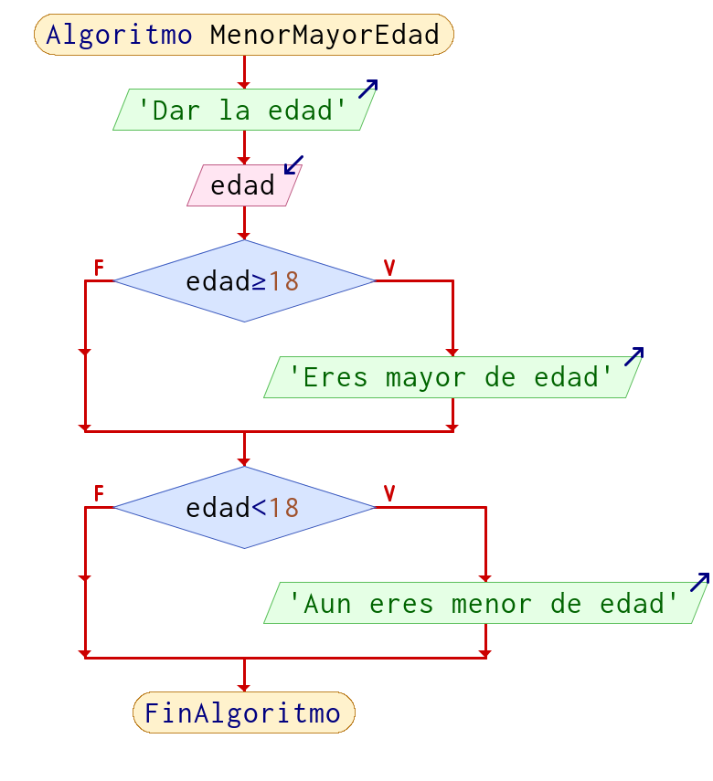
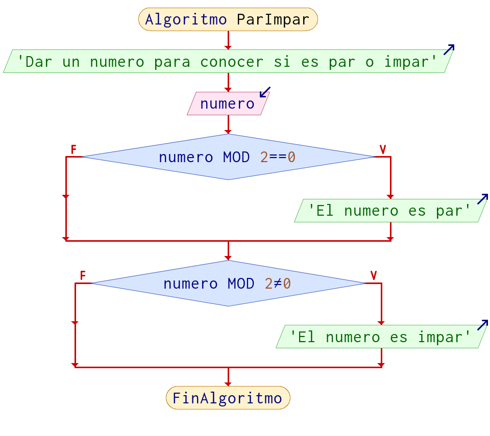
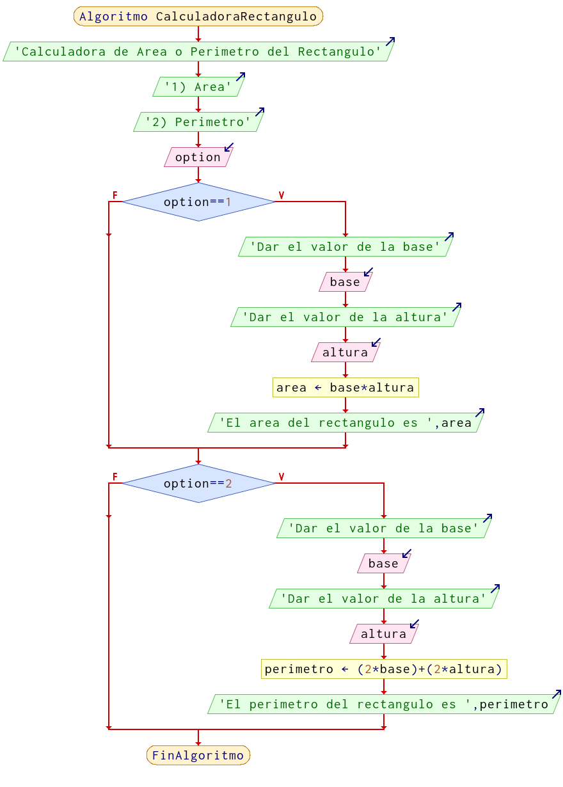

# Operadores de comparación o relación o para decisión 

Los operadores de relación te dan unicamente dos respuesta (*lógicas*) `si` o `no`, que son equivalentes a `true` o `false` (booleano), `uno` o `cero`, `1` o `0` (digitales), `0V` o `5V` (voltaje)respectivamente.

|Nombre|Matemáticas|Algoritmos (Programación)
|-|:-:|:-:|
|`Menor que`|<| <
|`Menor o igual que`|≤|<=
|`Mayor que`|>| >
|`Mayor o igual que`|≥| >=
|`Igual que`|=| ==
|`Diferente que`|≠| != 

> **Nota:** El *diferente de* puede variar por lenguaje

## Sintaxis de comparación

La forma en la que se escriben las comparaciones es:

|Izquierda|Centro|Derecha|
|:-:|:-:|:-:|
|`valor/variable`|`operador`|`valor/variable`|
|`5`|`==`|`8`|
|`a`|`>=`|`b`|
|`10`|`<=`|`x`|
|`a`|`<=`|`2`|


## Ejemplos de comparación

Las únicas comparaciones que se pueden realizar son entre números, con respecto a las letras o carácter (único), la comparación es en su valor [ASCII](https://elcodigoascii.com.ar), en si los textos no se pueden comparar; sin embargo, aplicado a un lenguaje en concreto esto puede variar.

|Comparación | Resultado|
|:-:|:-:|
|`5 > 8`| *no*|
|`10 > 8`| *si*|
|`20 > 5`| *no*|
|`8 >= 8`| *si*|
|`6 < 8`| *si*|
|`2 <= 8`| *si*|
|`0 == 8`| *no*|
|`1 != -8`| *si*|

Las comparaciones pueden ser entre variables, obviamente dicha variable debe contener un valor previamente.

En  este caso las variables tienen este valor:

- `a = 5` 
- `b = 2` 

|Comparación | Resultado|
|:-:|:-:|
|`a > b`| *si*|
|`a >= b`| *si*|
|`a < b`| *no*|
|`a <= b`| *no*|
|`a == b`| *no*|
|`a != b`| *si*|

## Ejemplos

!!! example "Ejemplo 1"
    Preguntar al usuario su edad e imprimir si es mayor o menor de edad en función de la edad.
    
    **Pseudocódigo**

    ```java
    Algoritmo MenorMayorEdad
        Imprimir "Dar la edad"
        Leer edad
        
        Si edad >= 18 Entonces
            Imprimir "Eres mayor de edad"
        FinSi
        
        Si edad < 18 Entonces
            Imprimir "Aun eres menor de edad"
        FinSi
		
    FinAlgoritmo
    ```
    **Diagrama de Flujo**

    


!!! example "Ejemplo 2"
    Solicitar un numero e indicar si es par o impar.
    
    **Pseudocódigo**

    ```java
    Algoritmo ParImpar
        Escribir 'Dar un numero para conocer si es par o impar'
        Leer numero
        Si numero % 2 == 0 Entonces
            Escribir 'El numero es par'
        FinSi
        
        Si numero % 2 <> 0 Entonces
            Escribir 'El numero es impar'
        FinSi
    FinAlgoritmo
    ```

    **Diagrama de flujo**

        


!!! example "Ejemplo 3"
    Calculadora para obtener el área o el perímetro de un rectángulo, dependiendo del usuario

    **Pseudocódigo**

    ```java
    Algoritmo CalculadoraRectangulo
        Escribir 'Calculadora de Area o Perimetro del Rectangulo'
        Escribir '1) Area'
        Escribir '2) Perimetro'
        Leer option
        
        Si option == 1 Entonces
            Imprimir "Dar el valor de la base"
            Leer base
            Imprimir "Dar el valor de la altura"
            Leer altura
            area = base * altura
            Imprimir "El area del rectangulo es ", area 
        FinSi
        
        Si option == 2 Entonces
            Imprimir "Dar el valor de la base"
            Leer base
            Imprimir "Dar el valor de la altura"
            Leer altura
            perimetro = (2*base) + (2* altura)
            Imprimir "El perimetro del rectangulo es ", perimetro
        FinSi
    FinAlgoritmo
    ```

    **Diagrama de flujo**

        

> Nota: No es la única forma en la que se pueden realizar estos ejercicios, recuerda que lo importante es resolver el problema, que hayan mas o menos pasos, diferentes formulas, etc, no significa que este mal.