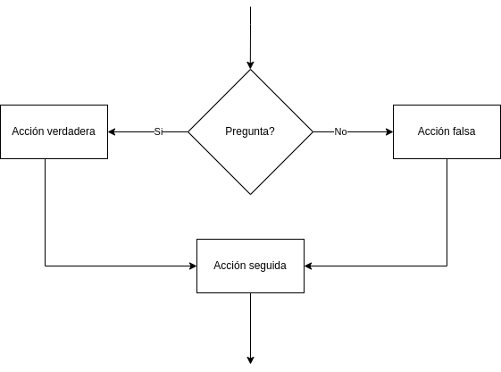
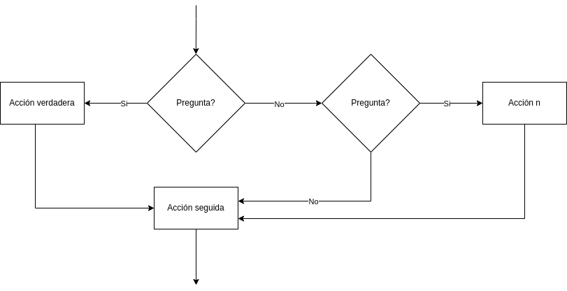
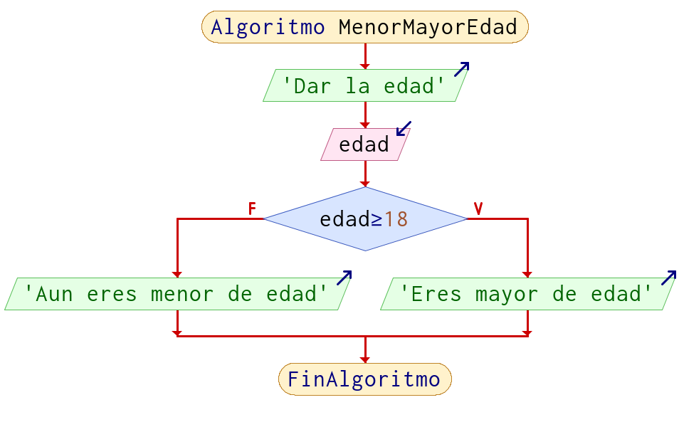
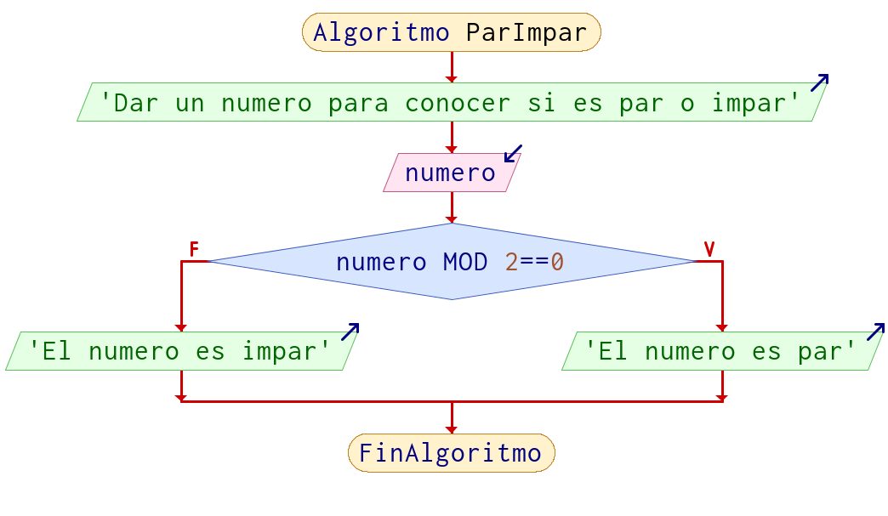
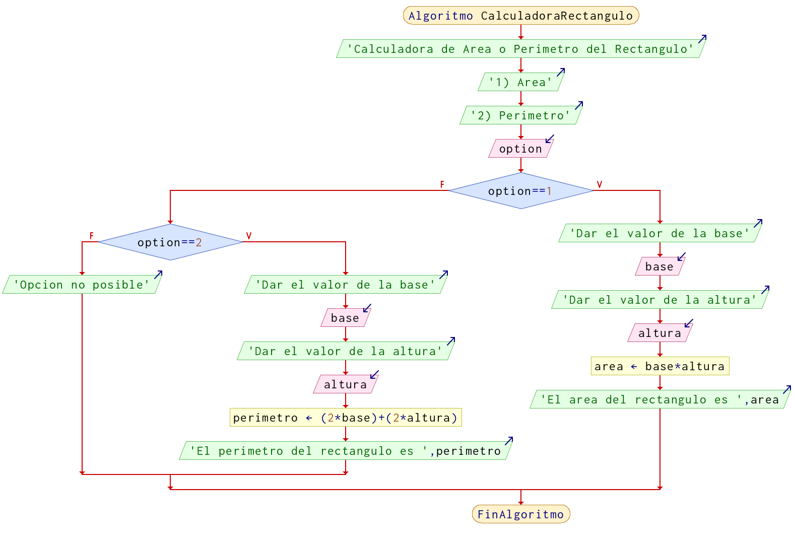

# Comparaciones o Decisiones (if-else) 

Previamente ya vimos como se realiza una decision, pero ahora se complementa esta decision en un formato en el cual forzosamente si no se cumple la decision, es decir, si no es verdadera tiene que realizar alguna acción y posteriormente continuar.

Otra manera de decirlo, **es que tiene que realizar una acción, en cada caso antes de continuar con la siguiente acción**.


<figcaption>Decision básica</figcaption>


Las preguntas pueden estar anidadas, es decir, después de la pregunta puede haber otro estructura que tenga que realizar una de las dos acciones y posteriormente continuar.



<figcaption>Decisiones anidadas</figcaption>

## Ejemplos

!!! example "Ejemplo 1"
    Preguntar al usuario su edad e imprimir si es mayor o menor de edad en función de la edad.
    
    **Pseudocódigo**

    ```python
    Algoritmo MenorMayorEdad
        Imprimir "Dar la edad"
        Leer edad
        
        Si edad >= 18 Entonces
            Imprimir "Eres mayor de edad"
        Sino	
            Imprimir "Aun eres menor de edad"
        FinSi
    FinAlgoritmo
    ```
    **Diagrama de Flujo**

    


!!! example "Ejemplo 2"
    Solicitar un numero e indicar si es par o impar.
    
    **Pseudocódigo**

    ```python
    Algoritmo ParImpar
        Escribir 'Dar un numero para conocer si es par o impar'
        Leer numero
        Si numero % 2 == 0 Entonces
            Escribir 'El numero es par'
        Sino
            Escribir 'El numero es impar'
        FinSi
    FinAlgoritmo
    ```

    **Diagrama de flujo**

    

!!! example "Ejemplo 3"
    Calculadora para obtener el área o el perímetro de un rectángulo, dependiendo del usuario, en caso de que de una opción que no existe mande un mensaje indicando "Opción no posible"

    **Pseudocódigo**

    ```python
    Algoritmo CalculadoraRectangulo
        Escribir 'Calculadora de Area o Perimetro del Rectangulo'
        Escribir '1) Area'
        Escribir '2) Perimetro'
        Leer option
        
        Si option == 1 Entonces
            Imprimir "Dar el valor de la base"
            Leer base
            Imprimir "Dar el valor de la altura"
            Leer altura
            area = base * altura
            Imprimir "El area del rectangulo es ", area 
        Sino 
            Si option == 2 Entonces
                Imprimir "Dar el valor de la base"
                Leer base
                Imprimir "Dar el valor de la altura"
                Leer altura
                perimetro = (2*base) + (2* altura)
                Imprimir "El perimetro del rectangulo es ", perimetro
            Sino 
                Imprimir "Opcion no posible"
            FinSi
        FinSi
    FinAlgoritmo
    ```

    **Diagrama de flujo**

        

> Nota: No es la única forma en la que se pueden realizar estos ejercicios, recuerda que lo importante es resolver el problema, que hayan mas o menos pasos, diferentes formulas, etc, no significa que este mal.