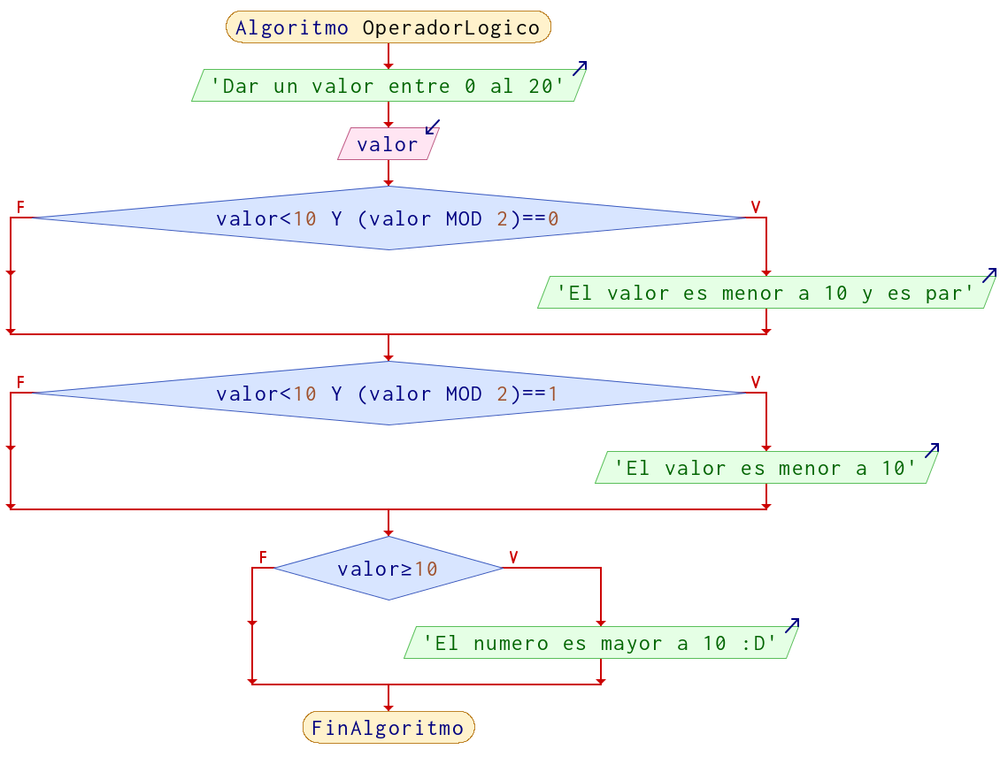
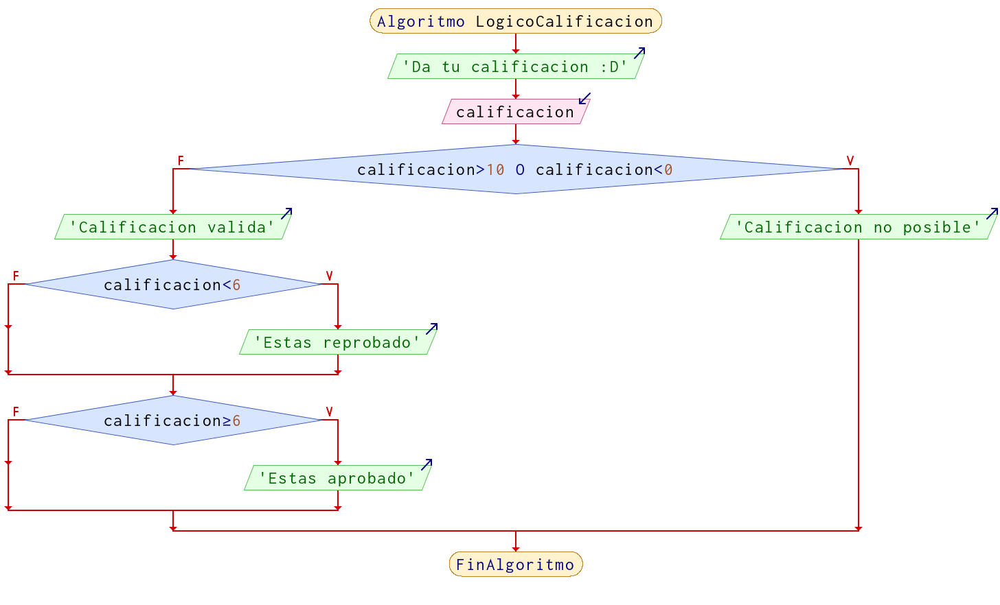

# Operadores lógicos

Un operador lógico sirve para combinar comparaciones y en función del resultado tomar una decisión, comprende de 3 operadores 
(*hay mas pero no lo veremos aquí*) que son `AND`, `OR` y `NOT`. Con todo ello para realizar varias validaciones y obtener un resultado `booleano`.

## Las tablas de verdad de los operadores:

### AND (Y)

|Entrada 1 | Entrada 2 | Salida
|-|-|-|
|`false` | `false` | `false`|
|`false` | `true` | `false`|
|`true` | `false` | `false`|
|`true` | `true` | `true`|

!!! note "Regla"
    ***AND** nos dice que mientras exista a la entrada un `false`, tendremos un valor `false` a la salida*

### OR (O)

|Entrada 1 | Entrada 2 | Salida|
|-|-|-|
|`false` | `false` | `false`|
|`false` | `true` | `true`|
|`true` | `false` | `true`|
|`true` | `true` | `true`|

!!! note "Regla"
    ***OR** nos dice que mientras exista a la entrada un `true`, tendremos un valor `true` a la salida*

### NOT (NO) (Inverter)

|Entrada| Salida|
|-|-|
|`false` | `true`|
|`true` | `false`|

!!! note "Regla"
    ***NOT** nos dice que todo lo que recibe lo invierte.*

### Sintaxis con operadores lógicos

La forma en la que se escriben las comparaciones con operadores lógicos es:

|Izquierda|Centro|Derecha|
|:-:|:-:|:-:|
|`comparación`|`operador lógico`|`comparación`|
|`(a == b)`|`&&` |`(x > y)`
|`(5 == 8)`|`&&` |`(9 > 4)`
|`(a >= b)`|`||`|`(0 == 8)`
|`(10 <= x)`|`&&`|`(1 != -8)`
|`(a <= 2)`|`||`|`(0 == 8)`

En el caso de `not` aplica solo a una comparación:

|Aplicación | Resultado
|:-:|:-:|  
|`!true`  | `false`|
|`!(3 == 3)` |`false` |
|`!(6 >= 1)` | `false`|
|`!(1 != 1)` |`true`|
|`!(3 < 3)` |`true`|


Se pueden concatenar (unir) **n comparaciones** con operadores lógicos, pero siempre se debe utilizar el operador para poder unir mas comparaciones, ejemplo:

`(5 == 8)` `&&` `(9 > 4)` `||` `(a >= b)` `||` `(0 == 8)` `&&` `!(2 == 2)`

### Ejemplos de comparación

| Descripción | Resultado
|-|:-:|
|`(9 > 4)` `&&` `(3 < 6)` | `true`
|`(8 == 3)` `||` `(2 != 3)` | `true`
|`!true` | `false`
|`(5 == 8)` `&&` `(9 > 4)`| `false`
|`(0 >= -5)` `||` `(0 == 8)`| `true`
|`(10 <= 5)` `&&` `(1 != -8)`| `false`
|`!(2 == 2)`| `false`

## Ejemplos

!!! example "Ejemplo 1"

    Solicitar un número de entre 0 al 20, si el número es menor a 10 y par, indicar que "el número es par y menor a 10"; si es menor a 10, pero no es **par** dar el mensaje "Número menor a 10", de lo contrario que indique que es mayor a 10. 
    
    **Pseudocódigo**
    
    ```python
    Algoritmo OperadorLogico
        Imprimir "Dar un valor entre 0 al 20"
        Leer valor
        
        
        Si valor < 10 Y (valor % 2) == 0 Entonces
            Imprimir "El valor es menor a 10 y es par"
        FinSi
        
        Si valor < 10 Y (valor % 2) == 1 Entonces
            Imprimir "El valor es menor a 10"
        FinSi
        
        Si valor >= 10 Entonces
            Imprimir  "El numero es mayor a 10 :D"
        FinSi
	
    FinAlgoritmo
    ```

    **Diagrama de Flujo**

    
    

!!! example "Ejemplo 2"
    En una variable almacena la calificación, se debe verificar el valor de la calificacion es valida; es decir, calificaciones arriaba de 10 y abajo de 0 no son posibles, la calificación reprobatoria es por debajo de 6 y aprobatoria arriaba de 6.0. 

     **Pseudocódigo**
    
    ```python
    Algoritmo LogicoCalificacion
        Escribir 'Da tu calificacion :D'
        Leer calificacion
        
        Si calificacion > 10 O calificacion < 0 Entonces
            Imprimir "Calificacion no posible"
        SiNo
            Imprimir "Calificacion valida"
            
            Si calificacion < 6 Entonces
                Imprimir "Estas reprobado"
            FinSi
            
            Si calificacion >= 6 Entonces
                Imprimir "Estas aprobado"
            FinSi
            
        FinSi	
    
    FinAlgoritmo
    ```

    **Diagrama de Flujo**

    
    
> ***Nota**: No es la única forma en la que se pueden realizar estos ejercicios, recuerda que lo importante es resolver el problema, que hayan mas o menos pasos, diferentes formulas, etc, no significa que este mal*.

<!-- text autogenerated footer --> <p>Facebook <a href="https://www.facebook.com/mecatronica85/" target="_blank">Mecatrónica 85</a></p><p>Realizado por <a href="https://www.alejandro-leyva.com" target="_blank">Alejandro Leyva</a></p>