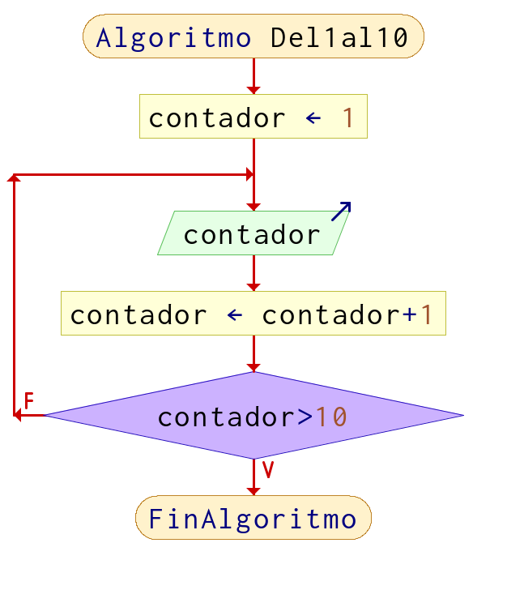
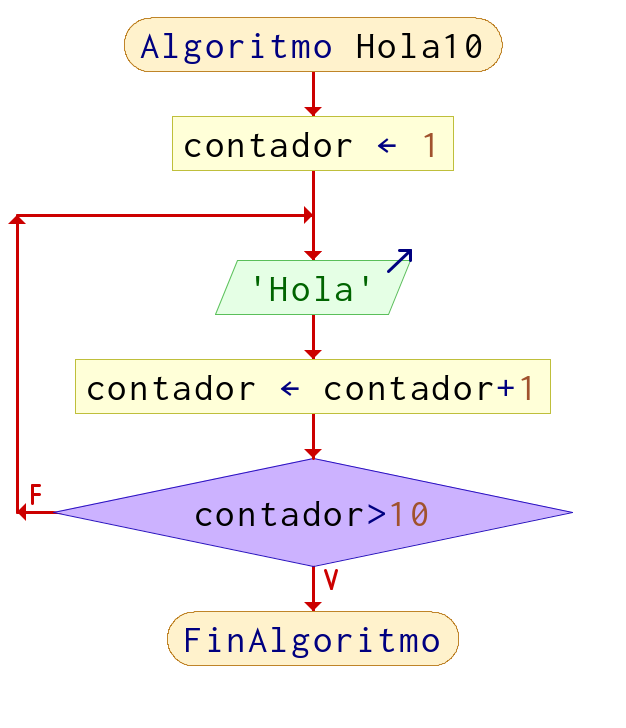
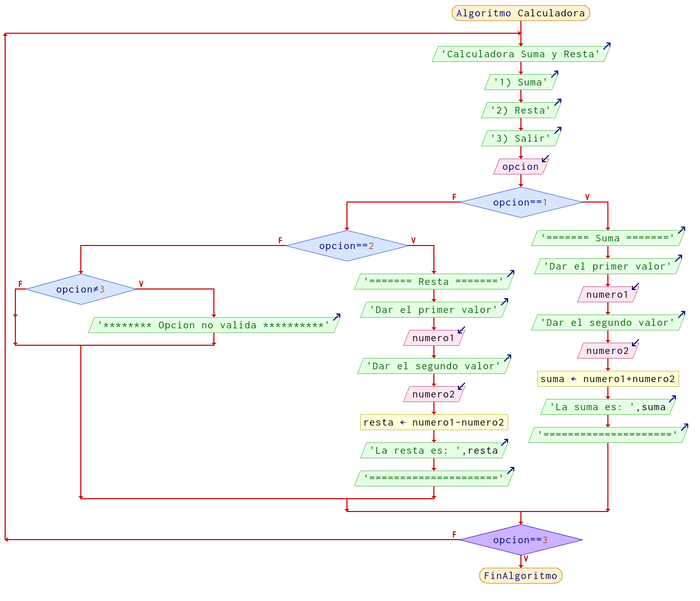

# Ciclos (Loops) (for, while)

La estructura de repetición o ciclo no ayuda a realizar iteraciones para realizar acciones que se van a repetir una cantidad de veces o incluso infinitas ocasiones. 
**Para que un ciclo termine se debe evaluar una comparación y con base al resultado, puede seguir o continuar.**

## Ejemplos de ciclos en la vida

- La respiración humana
- Los latidos del corazón
- La rotación de la tierra
- Las estaciones del año
- El ciclo de la vida
- El ciclo del agua
- La fotosíntesis

## La variable auxiliar 

Para poder lograr esto necesitamos una variable *auxiliar* la cual nos ayudara a saber si debemos terminar o continuar con la repetición.

**Ejemplos de nombres que recibe esta variable:** (Recordar las reglas de [como nombrar variables](03_Variables#c%C3%B3mo-nombrar-una-variable))

- `x`
- `i`
- `j`
- `k`
- `contador`
- `aux`
- `auxiliar`
- `count`
- `temp`
- `tmp`
- `temporal`

Son los nombres mas comunes que les dan a la variable que nos ayuda en el momento de que un ciclo comienza, avanza y termina, es nuestra bandera indicadora de estas tres acciones.

## Ejemplos 

!!! example "Ejemplo 1"
    
    Imprimir del 1 al 10
     **Pseudocódigo**
    
    ```python
    Algoritmo Del1al10
        
        contador = 1 //variable auxiliar, indica en donde inicia a contar
        
        Repetir
            Imprimir contador
            contador = contador + 1 // incremento cada iteración en 1
        Hasta Que contador > 10
        
    FinAlgoritmo
    ```

    **Diagrama de Flujo**

    

    

!!! example "Ejemplo 2"
    
    Imprimir 10 veces la palabra "hola"

    **Pseudocódigo**
    
    ```python
    Algoritmo Hola10
        contador = 1
        Repetir
            Escribir 'Hola'
            contador = contador+1
        Hasta Que contador>10
    FinAlgoritmo
    ```
    **Diagrama de Flujo**

    

!!! example "Ejemplo 3"
    
    Realizar una calculadora que sume y reste, con la opción de salir, pero solo hasta que el usuario elija dicha opción, podrá terminar el programa, de lo contrario seguirá mostrando las opciones de operaciones que puede realizar

     **Pseudocódigo**
    
    ```python
    Algoritmo Calculadora
		
        Repetir
            Imprimir "Calculadora Suma y Resta"
            Imprimir "1) Suma"
            Imprimir "2) Resta"
            Imprimir "3) Salir"
            Leer opcion
            
            Si opcion == 1 Entonces
                Imprimir "======= Suma ======="
                Imprimir "Dar el primer valor"
                Leer numero1
                Imprimir "Dar el segundo valor"
                Leer numero2
                suma = numero1 + numero2
                Imprimir "La suma es: ", suma
                Imprimir "====================="
            Sino 
                Si opcion == 2 Entonces
                    Imprimir "======= Resta ======="
                    Imprimir "Dar el primer valor"
                    Leer numero1
                    Imprimir "Dar el segundo valor"
                    Leer numero2
                    resta = numero1 - numero2
                    Imprimir "La resta es: ", resta
                    Imprimir "====================="
                SiNo
                    Si opcion != 3 Entonces
                        Imprimir  "******** Opcion no valida **********"
                    FinSi
                FinSi
            FinSi
        Hasta Que opcion == 3
    FinAlgoritmo
    ```
    **Diagrama de Flujo**

    

> _**Nota**: No es la única forma en la que se pueden realizar estos ejercicios, recuerda que lo importante es resolver el problema, que hayan mas o menos pasos, diferentes formulas, etc, no significa que este mal._


<!-- text autogenerated footer --><hr><blockquote>Facebook <a href="https://www.facebook.com/mecatronica85/" target="_blank">Mecatrónica 85</a></blockquote><blockquote>Realizado por <a href="https://www.alejandro-leyva.com" target="_blank">Alejandro Leyva</a></blockquote>