# Ejemplos con PSeint

Ejemplos explicados y resueltos en clase

## Hola mundo

Mandar un mensaje a la pantalla 

### Código PSeint

```python
Algoritmo saludo
	Escribir "Hola mundo"
FinAlgoritmo
```
### Diagrama de flujo

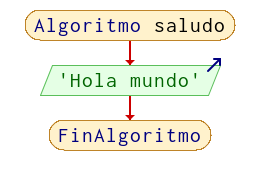

## Calculadora Suma

Realizar una calculadora que sume 2 números, solicitándolos al usuario

### Código PSeint

```python
Algoritmo Calculadora_suma
	Escribir '================================'
	Escribir 'Calculadora que suma 2 números'
	Escribir '================================'
	Escribir 'Dar un valor'
	Leer valor1
	Escribir 'Dar otro valor'
	Leer valor2
	Escribir  'Dar otro valor'
	Leer valor3
	suma <- valor1+valor2 + valor3
	Escribir 'El resultado de la suma es: ',suma
	multiplicacion = valor1 * valor2 * valor3
	Escribir 'El resultado de la multip es: ',multiplicacion
FinAlgoritmo

```
### Diagrama de flujo

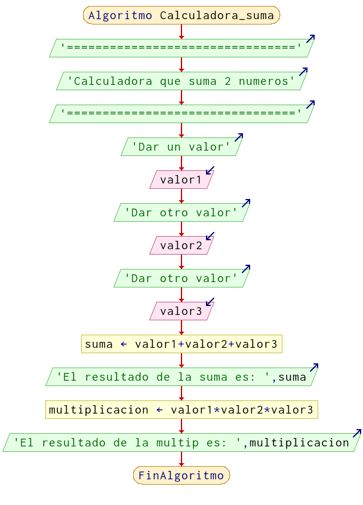

## Calculadora de perímetro rectángulo    

un programa para calcular el perímetro del rectángulo, solicitándole al usuario sus lados  e imprimir el resultado, con el siguiente  formato (ejemplo) "El perímetro del rectángulo es 13.4 unidades", después que entregue el área 

### Código PSeint

```python
Algoritmo calculadora_rectangulo
	Escribir "Calculadora del rectangulo"
	Escribir  "Dar el valor de la base"
	Leer base
	Escribir  "Dar el valor de la altura"
	Leer altura
	perimetro = (2*base) + (2*altura)
	area = base * altura
	Escribir  "El perimetro es ", perimetro, " unidades"
	Escribir "El area es ", area, " unidades cuadradas" 
FinAlgoritmo
```
### Diagrama de flujo

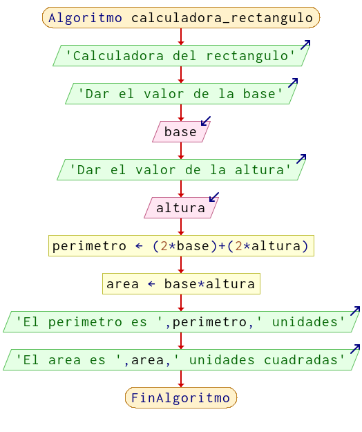

## Mascotas

Realizar un programa que le solicite al usuario, cuantas mascotas tiene, en caso que tenga 3 o mas le darás el mensaje "Eres amantes de los animales", sino le dirás "necesitas un gatito"

### Código PSeint

```python
Algoritmo Mascotas_
	
	Escribir 'Dar la cantidad de mascotas'
	Leer mascotas
	
	Si mascotas >= 3 Entonces
		Escribir 'Eres amantes de los animales'
	SiNo
		Escribir 'necesitas un gatito'
	FinSi
	
FinAlgoritmo

```
### Diagrama de flujo

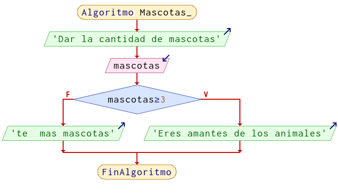

## Calculadora Área/Perímetro Cuadrado  

Realizar un programa que calcule el area o perímetro del cuadrado, dependiendo de la respuesta solicitar los datos e imprimir el resultado

### Código PSeint

```python
Algoritmo calculadora_perimetro_area_cuadrado
	lado = 0 //la variable que usare para guardar la información
	Escribir "Calculadora del Cuadrado"
	Escribir "1) Perimetro"
	Escribir "2) Area"
	Leer opcion
	
	Escribir "Dar el valor del lado"
	Leer lado
	
	Si opcion == 1 Entonces
		perimetro = lado *4
		Escribir "El perimetro es: ", perimetro
	SiNo
		area = lado * lado
		Escribir "El area es: ", area
	FinSi
FinAlgoritmo
```
### Diagrama de flujo

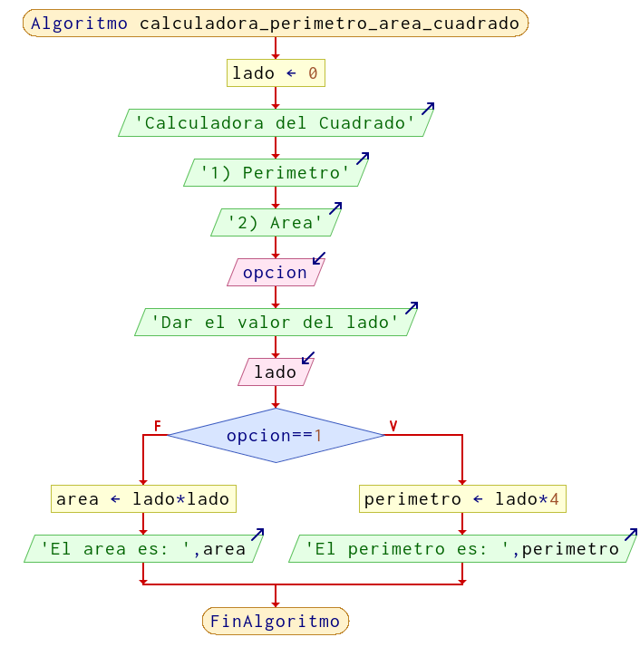

## Calculadora Cuadrado con opción de salir y mensaje de error

### Código PSeint

```python
Algoritmo Calculadora_Cuadrado
	Escribir 'Calculadora Cuadrado'
	Escribir '1) Area'
	Escribir '2) Perímetro'
	Escribir '3) Salir'
	Leer opcion
	Si opcion==1 Entonces
		Escribir 'Dar lado'
		Leer lado
		Escribir 'El Area es: ',(lado*lado)
	SiNo
		Si opcion==2 Entonces
			Escribir 'Dar lado'
			Leer lado
			Escribir 'El Perímetro es: ',(lado*4)
		SiNo
			Si opcion==3 Entonces
				Escribir 'Hasta la proxima inge'
			SiNo
				Escribir 'La opcion no existe'
			FinSi
		FinSi
	FinSi
FinAlgoritmo
```
### Diagrama de flujo

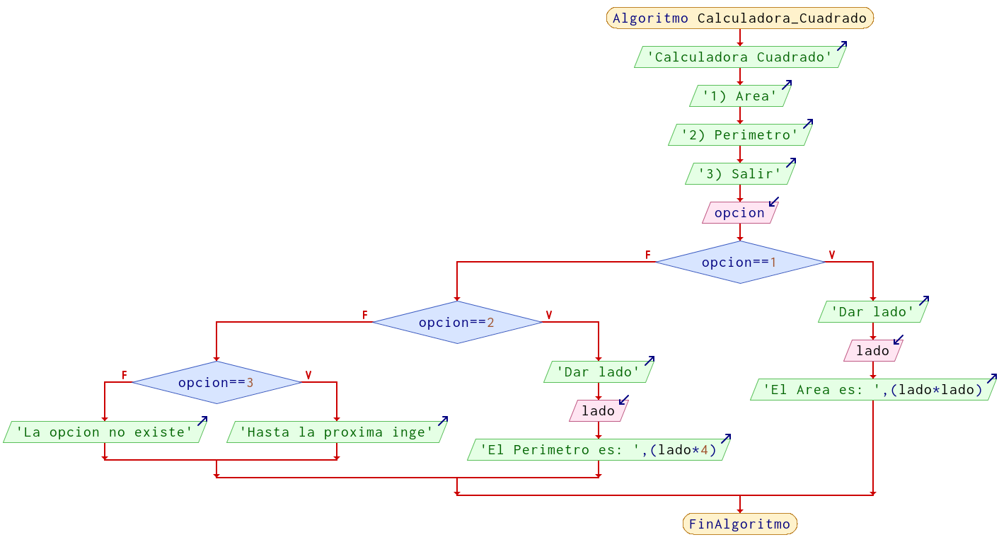

## Mensaje con base a calificación (operador lógico)

### Código PSeint

```python
Algoritmo operador_logico
	
	Escribir "Da tu calificacion"
	Leer calificacion
	
	Si calificacion<= 10 Y calificacion >=6 Entonces
		Escribir "Pasaste"
	SiNo
		Si calificacion <6 Y calificacion >=0 Entonces
			Escribir "Te veo en recursa"
			
		SiNo
			Escribir "Calificacion no valida"
		FinSi
	FinSi
FinAlgoritmo
```
### Diagrama de flujo

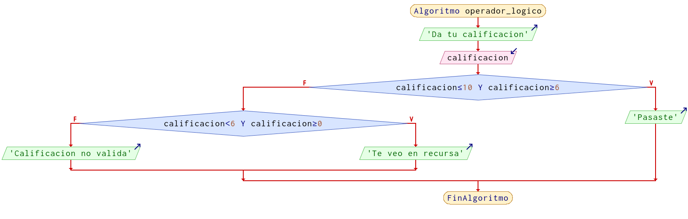


## Mensaje (ciclo)

Realizar un programa que imprima un mensaje 10 veces, usando ciclos

### Código PSeint

```python
Algoritmo Hola
	contador = 0
	Repetir
		Escribir " HOLA"
		contador = contador+1
	Hasta Que contador == 10
	
FinAlgoritmo

```
### Diagrama de flujo


## Imprimir del 1 al 10

Realizar un programa que imprima del numero 1 hasta el 10, con un ciclo

### Código PSeint

```python
Algoritmo contador_10	
	contador = 1
	Repetir
		Escribir contador
		contador = contador+1
	Hasta Que contador > 10
FinAlgoritmo
```
### Diagrama de flujo

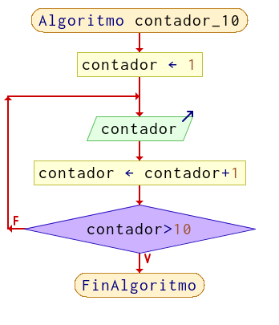


## Tabla de multiplicar del 3

### Código PSeint

```python
Algoritmo tabla_3
	tabla = 3
	contador = 1
	Repetir 
		resultado = tabla * contador
		Escribir tabla " X " contador , " = ", resultado
		contador= contador+1
	Hasta Que contador > 10	
FinAlgoritmo
```
### Diagrama de flujo

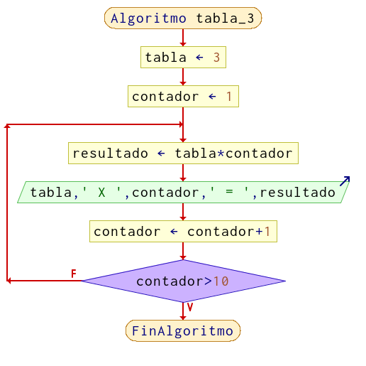


## Calculadora Suma-resta con opcion de salir (infinito)

### Código PSeint

```python
Algoritmo calculadora_infinita
	opcion <- 0
	Repetir
		Escribir '============================================================='
		Escribir 'Calculadora de suma o resta'
		Escribir '1) Sumar'
		Escribir '2) Restar'
		Escribir '3) Salir'
		Leer opcion
		Si opcion==3 Entonces
			Escribir 'Adiosito'
		SiNo
			Si opcion==1 Entonces
				Escribir 'Dar el primer numero'
				Leer a
				Escribir 'Dar el segundo numero'
				Leer b
				Escribir 'La suma es ',(a+b)
			SiNo
				Si opcion==2 Entonces
					Escribir 'Dar el primer numero'
					Leer a
					Escribir 'Dar el segundo numero'
					Leer b
					Escribir 'La resta es ',(a-b)
				SiNo
					Escribir 'La opción no existe'
				FinSi
			FinSi
		FinSi
	Hasta Que opcion==3
FinAlgoritmo

```
### Diagrama de flujo

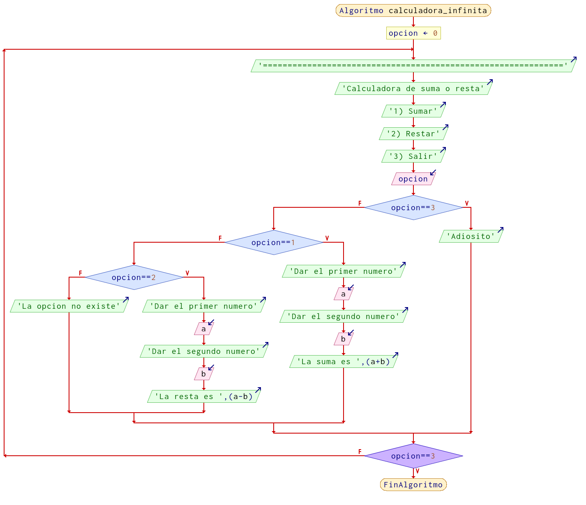

## Factorial

### Código PSeint

```python
Algoritmo calcula_factorial
	Escribir 'Dar un número entero para calcular el factorial'
	Leer numero
	Si numero==0 O numero==1 Entonces
		Escribir 'El factorial es ',numero
	SiNo
		factorial <- 1
		contador <- numero
		Repetir
			factorial <- factorial*contador
			contador <- contador-1
		Hasta Que contador==1
		Escribir 'El factorial de ',numero,' es ',factorial
	FinSi
FinAlgoritmo
```
### Diagrama de flujo

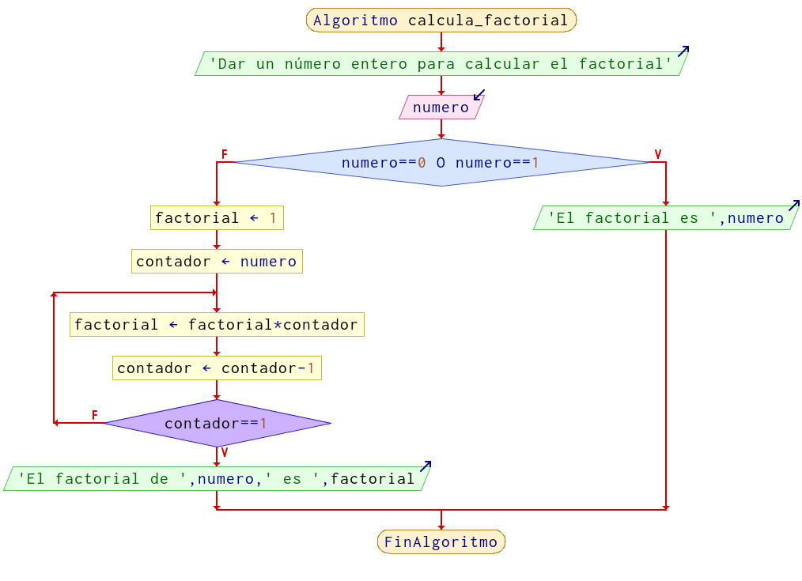


## Resistencia Serie infinita

Realizar una calculadora de para resistencia en seria, la cantidad de resistencias es ilimitada, el usuario decide  cuando debe parar la solicitud de valores, es decir, para detener el programa se debe dar el valor de -1.

### Código PSeint

```python
Algoritmo resistencia_serie_infinita
	resitenciaTotal = 0
	contador = 1
	Repetir
		Escribir "Dar la resistencia ", contador, ", para salir escribe -1"
		Leer resistencia
		
		Si resistencia <> -1 Entonces
			resitenciaTotal = resitenciaTotal + resistencia
			contador = contador +1
		FinSi
		
	Hasta Que resistencia == -1
	
	Escribir "La resistencia total de ", contador," en serie: ", resitenciaTotal ," ohms"
FinAlgoritmo

```
### Diagrama de flujo

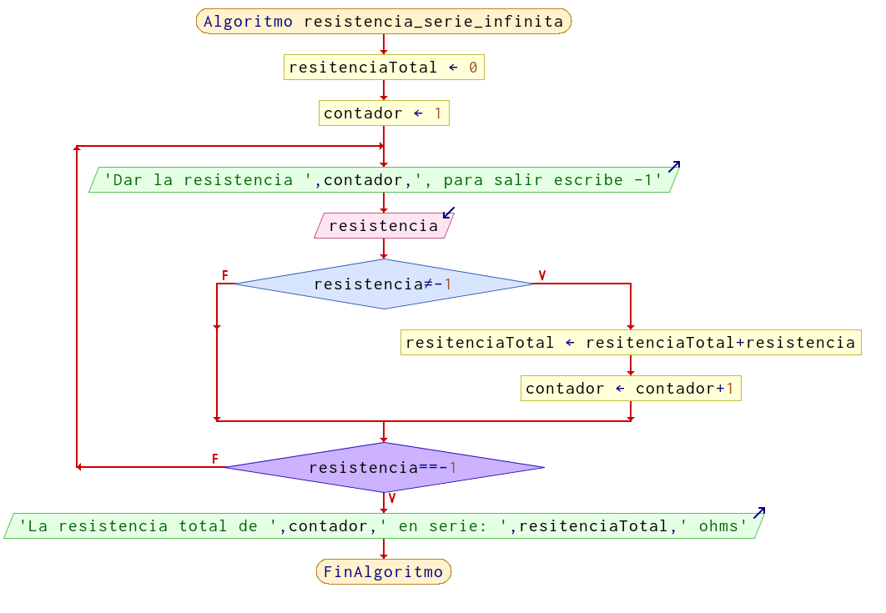

<!-- ## Nombre del programa

### Código PSeint

```python

```
### Diagrama de flujo

<!--  -->

## Nombre del programa

### Código PSeint

```python

```
### Diagrama de flujo

<!--  -->